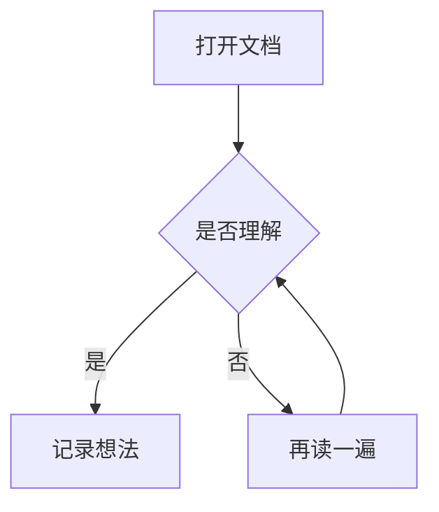

# 我的第一份笔记

把这份文件拖进墨读试试。

## 一段文字

**重点**、*强调*、`inline code`，以及公式 $E=mc^2$。

## 一份表格

| 项目 | 状态 |
| --- | --- |
| 本地阅读 | 支持 |
| 登录注册 | 不需要 |

## 一个清单

- [x] 打开文档
- [ ] 调整字号

## 一段代码

```python
print("Hello, Markdown!")
```

## 一张图


